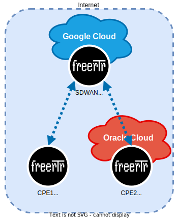

# SD-WAN Experiment

[Software Defined WAN](http://sdwan.freertr.org/), on RARE/freeRtr, is the easily diagnosticable mesh for ipv4 and ipv6 networks to stay current and connected.

## Overview
A [software-defined wide area network](https://www.paloaltonetworks.com/cyberpedia/what-is-a-sd-wan) (SD-WAN) is a virtualized service that connects and extends enterprise networks over large geographical distances. WANs use links such as multiprotocol label switching (MPLS), wireless, broadband, virtual private networks (VPNs) and the internet to give users in remote offices access to corporate applications, services and resources, allowing them to work regardless of location. SD-WAN monitors the performance of WAN connections and manages traffic in an effort to maintain high speeds and optimize connectivity.

## Topology


## VM Settings
Debian 11.3 (SID), RAM 2 GB, CPU 2 vCPU, HD 20 GB, and "one line" RARE/freeRtr install.

## SD-WAN Settings
On SD-WAN server
```bash
...
interface loopback0
 vrf forwarding inet
 ipv4 address 10.10.10.99 255.255.255.255
 no shutdown
 no log-link-change
 exit
!
ipv4 pool p4 20.20.20.10 0.0.0.1 3
server sdwan gcloud
 security authentication users
 security rsakey rsa
 security dsakey dsa
 security ecdsakey ecdsa
 pool4 p4
 vrf inet
 exit
!
...
```

On clients.
```bash
...
interface dialer1
 encapsulation ppp
 vrf forwarding inet
 ipv4 address dynamic dynamic
 no shutdown
 no log-link-change
 exit
!
proxy-profile p1
 vrf inet
 source ethernet1
 exit
!
vpdn gcloud
 interface dialer1
 proxy p1
 target 10.10.10.99
 username users
 password $v10$cA==
 prefer ipv4
 protocol sdwan
 exit
!
...
```

## References
http://sdwan.freertr.org/

https://www.paloaltonetworks.com/cyberpedia/what-is-a-sd-wan
