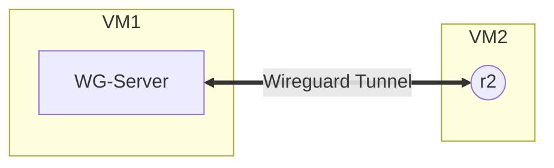

# Wireguard tunnel between WG-Server (VM1) and router R2 (VM2)

## Topology
VM1 (10.65.10.66/16) and VM2 (10.65.10.63)


## Wireguard Server Config (VM1)
Edit the `wg0.conf` file with the command `sudo nano /etc/wireguard/wg0.conf`:
```zsh
[Interface]
Address = 192.168.1.1/24
ListenPort = 51820
PrivateKey = <debian-vm1-private-key>

[Peer]
PublicKey = <freertr-vm2-public-key>
AllowedIPs = 192.168.1.0/24
```

## freeRouter HW and SW configs (VM2)
Hardware configuration file `sudo nano /rtr/rtr-hw.txt`:
```zsh
int eth1 eth 0000.2222.0001 127.0.0.1 20001 127.0.0.1 65535
tcp2vrf 2323 v1 23
proc eth0 sudo /rtr/pcapInt.bin eth0 65535 127.0.0.1 20001 127.0.0.1
```
Software configuration file `sudo nano /rtr/rtr-hw.txt`:
```zsh
hostname r2
!
vrf definition v1
 exit
!
prefix-list p4
 sequence 10 permit 0.0.0.0/0 ge 0 le 0
 exit
!
interface lo1
 description Wireguard allowed IPv4 network
 vrf forwarding v1
 ipv4 address 192.168.1.2 /24
 no shutdown
 no log-link-change
 exit
!
crypto ipsec ips1
 desc <freertr-r2-private-key><debian-vm1-public-key>
 key <freertr-r2-private-key><debian-vm1-public-key>
 exit
!
interface tun1
 desc r2@lo1 -> ????
 tunnel vrf v1
 tunnel protection ips1
 tunnel key 51820
 tunnel mode wireguard
 tunnel source eth1
 tunnel destination 10.65.10.66
 vrf for v1
 ipv4 addr 192.168.1.3 /24
 exit
!
interface eth1
 desc r2@e1 -> eth0
 vrf forwarding v1
 ipv4 address dynamic /16
 ipv4 gateway-prefix p4
 ipv4 dhcp-client enable
 ipv4 dhcp-client early
 no shutdown
 no log-link-change
 exit
!
server telnet tel
 security protocol telnet
 exec timeout 10000000
 exec colorize prompt
 exec logging
 no exec authorization
 no login authentication
 login logging
 vrf v1
 exit
!
end
```
