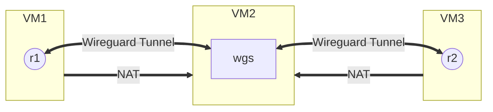

# Wireguard tunnel between R1 (VM1), WGS (VM2) and R2 (VM3)
[Wireguard](https://www.wireguard.com/) gained a lot of popularity and attention when [it was incorporated into the Linux Kernel in March 2020](https://en.wikipedia.org/wiki/WireGuard). In this tutorial, we demonstrate the connection between two isolated VMs through the Wireguard tunnel. 

## Requirements
- [VirtualBox](https://www.virtualbox.org/wiki/Downloads)
- [Vagrant](https://www.vagrantup.com/downloads)
- [Wireguard](https://www.wireguard.com/install/)
- [RARE/freeRtr](http://www.freertr.org/)

## Overview
In this tutorial, we demonstrate the necessary configurations to establish a tunnel between routers `R1` (`VM1`) and `R2` (`VM3`) passing through the `WGS` (`VM2`).\
An important point that we must observe is the isolation between the virtual machines VM1 and VM3, which allows demonstrating the effectiveness of the tunnel.

## Topology
VM1 (NAT), VM2 (NAT/Bridge) and VM3 (NAT)


## Vagrant Configuration
This tutorial has been tested and run on [Ubuntu 22.04](http://www.releases.ubuntu.com/22.04/). All commands outside the context of VMs use this OS.\
Choose a directory to place the `Vagrantfille` files, such as `/home/$USER/experiment`, or any other location you want.\
Create the necessary directories for the experiment with the command:
```zsh
mkdir /home/$USER/experiment/{r1,r2,wgs}
```

### VM1 Vagrant config
Simplified version of `VM1` Vagrantfile config `nano /home/$USER/experiment/r1/Vagrantfile`.
```zsh
# -*- mode: ruby -*-
# vi: set ft=ruby :

Vagrant.configure("2") do |config|
  # vagrant box
  config.vm.box = "debian/bullseye64"
  
  # changing the hostname
  config.vm.hostname = "r1"

  # sharing files between host and guest
  config.vm.synced_folder ".", "/home/vagrant/data"

  # https://www.vagrantup.com/docs/networking/forwarded_ports
  config.vm.usable_port_range = 8000..8999

  # Provider-specific configuration. These expose provider-specific options.
  config.vm.provider "virtualbox" do |vb|
 	# Customize the amount of memory on the VM:
 	vb.memory = "1024"
 	vb.cpus = 1
 	vb.name = "debian-bullseye64-vm1"
  end

  # Provisioning guest
  config.vm.provision "shell", inline: <<-SHELL
    apt-get update
    apt-get upgrade -y
    apt-get install -y default-jre-headless --no-install-recommends
    wget www.freertr.net/rtr.jar
    wget www.freertr.net/rtr-`uname -m`.tar -O rtr.tar
    mkdir /rtr
    mv rtr.* /rtr
    tar -xvf /rtr/rtr.tar -C /rtr
  SHELL
end
```

### VM2 Vagrant config
Similar to `VM1` config `nano /home/$USER/experiment/wgs/Vagrantfile`, just changing guest provisioning only.

```zsh
# -*- mode: ruby -*-
# vi: set ft=ruby :

Vagrant.configure("2") do |config|
  # vagrant box
  config.vm.box = "debian/bullseye64"
  
  # changing the hostname
  config.vm.hostname = "wgs"
  
  # Create a public network, which generally matched to bridged network.
  config.vm.network "public_network", bridge: "enp3s0", use_dhcp_assigned_default_route: true
  
  # sharing files between host and guest
  config.vm.synced_folder ".", "/home/vagrant/data"

  # https://www.vagrantup.com/docs/networking/forwarded_ports
  config.vm.usable_port_range = 8000..8999

  # Provider-specific configuration. These expose provider-specific options.
  config.vm.provider "virtualbox" do |vb|
 	# Customize the amount of memory on the VM:
 	vb.memory = "1024"
 	vb.cpus = 1
 	vb.name = "debian-bullseye64-wgs"
  end

  # Provisioning guest
  config.vm.provision "shell", inline: <<-SHELL
    apt-get update
    apt-get upgrade -y
    apt-get install -y wireguard
  SHELL
end
```

### VM3 Vagrant config
Similar to `VM1` config `nano /home/$USER/experiment/r2/Vagrantfile`, just changing `config.vm.hostname` to `"r2"` and `vb.name` to `"debian-bullseye64-vm2"`.

### Create/Start the VMs
Use the vagrant up command on directories:

- `cd /home/$USER/experiment/r1`
- `cd /home/$USER/experiment/wgs`
- `cd /home/$USER/experiment/r2`

This command will create and start the virtual machines `VM1`, `VM2` and `VM3`, additionally it will also install the necessary dependencies for the experiment such as RARE/freeRtr and Wireguard.

## Wireguard Server Config (VM2)
Generate the public and private keys for `wgs`, `r1` and `r2`.
```zsh
umask 077 && wg genkey > wgs-private-key && wg pubkey < wgs-private-key > wgs-public-key
umask 077 && wg genkey > r1-private-key && wg pubkey < r1-private-key > r1-public-key
umask 077 && wg genkey > r2-private-key && wg pubkey < r2-private-key > r2-public-key
```

Edit the `wg0.conf` file with the command `sudo nano /etc/wireguard/wg0.conf`:
```zsh
[Interface]
Address = 10.10.10.10/24
ListenPort = 51820
PrivateKey = <debian-vm1-private-key>

[Peer]
PublicKey = <freertr-vm1-public-key>
AllowedIPs = 10.10.10.1/32

[Peer]
PublicKey = <freertr-vm2-public-key>
AllowedIPs = 10.10.10.2/32
```

## Routers configuration (freeRtr)

### R1 HW and SW configs (VM1)
Hardware configuration file `sudo nano /rtr/rtr-hw.txt`:
```zsh
int eth1 eth 0000.1111.0001 127.0.0.1 10001 127.0.0.1 65535
tcp2vrf 1123 v1 23
proc eth0 sudo /rtr/pcapInt.bin eth0 65535 127.0.0.1 10001 127.0.0.1
```
Software configuration file `sudo nano /rtr/rtr-sw.txt`:
```zsh
hostname r1
!
crypto ipsec ips1
 description <r1-private-key><wireguard-server-public-key>
 key GExWuXQ9RV4E+xeK/sXjk+DvBPJEAVbS5Z0KaWh2fV0=8i7QSghwslgQ3LCHg5pnEtkVgyd1KooDJK5F3xKYJTc=
 exit
!
prefix-list all4
 sequence 10 permit 0.0.0.0/0 ge 0 le 0
 exit
!
prefix-list all6
 sequence 10 permit ::/0 ge 0 le 0
 exit
!
vrf def v1
 exit
!
int eth1
 no desc
 vrf for v1
 ipv4 address dynamic dynamic
 ipv4 gateway-prefix all4
 ipv4 dhcp-client enable
 ipv4 dhcp-client early
 no shutdown
 no log-link-change
 exit
!
interface tunnel1
 description r2@eth1 -> wgs-ip-eth1@51820
 tunnel key 51820
 tunnel vrf v1
 tunnel protection ips1
 tunnel source eth0
 tunnel destination <wgs-ip-eth1>
 tunnel mode wireguard
 vrf forwarding v1
 ipv4 address 10.10.10.1 /24
 no shutdown
 no log-link-change
 exit
!
server telnet tel
 security protocol telnet
 exec timeout 10000000
 exec logging
 no exec authorization
 no login authentication
 login logging
 vrf v1
 exit
!
end
```

### R2 HW and SW configs (VM3)
Hardware configuration file `sudo nano /rtr/rtr-hw.txt`:
```zsh
int eth1 eth 0000.2222.0001 127.0.0.1 20001 127.0.0.1 65535
tcp2vrf 2223 v1 23
proc eth0 sudo /rtr/pcapInt.bin eth0 65535 127.0.0.1 20001 127.0.0.1
```
Software configuration file `sudo nano /rtr/rtr-sw.txt`:
```zsh
hostname r2
!
crypto ipsec ips1
 description <r1-private-key><wgs-public-key>
 key GExWuXQ9RV4E+xeK/sXjk+DvBPJEAVbS5Z0KaWh2fV0=8i7QSghwslgQ3LCHg5pnEtkVgyd1KooDJK5F3xKYJTc=
 exit
!
prefix-list all4
 sequence 10 permit 0.0.0.0/0 ge 0 le 0
 exit
!
prefix-list all6
 sequence 10 permit ::/0 ge 0 le 0
 exit
!
vrf def v1
 exit
!
int eth1
 no desc
 vrf for v1
 ipv4 address dynamic dynamic
 ipv4 gateway-prefix all4
 ipv4 dhcp-client enable
 ipv4 dhcp-client early
 no shutdown
 no log-link-change
 exit
!
interface tunnel1
 description r2@eth1 -> wgs-ip-eth1@51820
 tunnel key 51820
 tunnel vrf v1
 tunnel protection ips1
 tunnel source eth1
 tunnel destination <wgs-ip-eth1>
 tunnel mode wireguard
 vrf forwarding v1
 ipv4 address 10.10.10.2 /24
 no shutdown
 no log-link-change
 exit
!
server telnet tel
 security protocol telnet
 exec timeout 10000000
 exec logging
 no exec authorization
 no login authentication
 login logging
 vrf v1
 exit
!
end
```

### Start RARE/freeRtr
Edit `start.sh` file with the command `sudo nano /home/vagrant/start.sh`:
```zsh
#!/bin/sh
# This script start the RARE/freeRtr router
java -jar /rtr/rtr.jar routersc /rtr/rtr-hw.txt /rtr/rtr-sw.txt
```
Make it executable:
```zsh
sudo chmod +x start.sh
```

## Verification
On r1...\
On r2...\

## Conclusion
In this tutorial we learned how to configure a Wireguard tunnel between routers r1 and r2, isolated in different VM contexts, through the Wireguard server.

## References
- [Vagrant Documentation](https://www.vagrantup.com/docs)
- [Wireguard Documentation](https://www.wireguard.com/)
- [RARE/freeRtr Documentation](http://docs.freertr.org/)
- [Wireguard and RARE/freeRtr integration example](https://wiki.geant.org/pages/viewpage.action?pageId=270630994)
