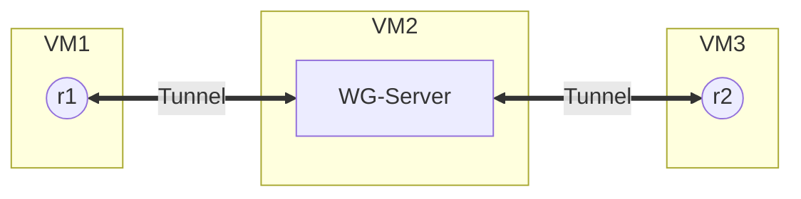

# Wireguard tunnel between R1 (VM1), WG-Server (VM2) and R2 (VM3)

## Topology
VM1 (10.250.250.242/16), VM2 (10.250.250.243/16) and VM2 (10.250.250.244/16)


## VM configuration (Vagrant)

### VM1 Vagrant config
```zsh
# -*- mode: ruby -*-
# vi: set ft=ruby :

Vagrant.configure("2") do |config|
  # vagrant box
  config.vm.box = "debian/bullseye64"

  # sharing files between host and guest
  config.vm.synced_folder ".", "/home/vagrant_data"

  # https://www.vagrantup.com/docs/networking/forwarded_ports
  config.vm.usable_port_range = 8000..8999

  # Provider-specific configuration. These expose provider-specific options.
  config.vm.provider "virtualbox" do |vb|
 	# Customize the amount of memory on the VM:
 	vb.memory = "1024"
 	vb.cpus = 1
 	vb.name = "debian-bullseye64-vm1"
  end

 # Provisioning guest
  config.vm.provision "shell", inline: <<-SHELL
    apt-get update
    apt-get upgrade -y
    apt-get install -y default-jre-headless --no-install-recommends
    wget www.freertr.net/rtr.jar
    wget www.freertr.net/rtr-`uname -m`.tar -O rtr.tar
    mkdir /rtr
    mv rtr.* /rtr
    tar -xvf /rtr/rtr.tar -C /rtr
  SHELL
end
```

### VM2 Vagrant config
Similar to VM1 configuration. Just changing `vb.name="debian-bullseye64-vm2"`.

### VM3 Vagrant config

### R1 HW and SW configs (VM1)
Hardware configuration file `sudo nano /rtr/rtr-hw.txt`:
```zsh
int eth1 eth 0000.1111.0001 127.0.0.1 20001 127.0.0.1 65535
tcp2vrf 2323 v1 23
proc eth0 sudo /rtr/pcapInt.bin eth0 65535 127.0.0.1 20001 127.0.0.1
```
Software configuration file `sudo nano /rtr/rtr-sw.txt`:
```zsh
hostname r1
!
crypto ipsec ips1
 description <r1-private-key><wireguard-server-public-key>
 key GExWuXQ9RV4E+xeK/sXjk+DvBPJEAVbS5Z0KaWh2fV0=8i7QSghwslgQ3LCHg5pnEtkVgyd1KooDJK5F3xKYJTc=
 exit
!
prefix-list all4
 sequence 10 permit 0.0.0.0/0 ge 0 le 0
 exit
!
prefix-list all6
 sequence 10 permit ::/0 ge 0 le 0
 exit
!
vrf def v1
 exit
!
int eth1
 no desc
 vrf for v1
 ipv4 address dynamic dynamic
 ipv4 gateway-prefix all4
 ipv4 dhcp-client enable
 ipv4 dhcp-client early
 no shutdown
 no log-link-change
 exit
!
interface tunnel1
 description r2@eth1 -> wireguard-server[200.137.68.76]@51820
 tunnel key 51820
 tunnel vrf v1
 tunnel protection ips1
 tunnel source eth1
 tunnel destination 200.137.68.76
 tunnel mode wireguard
 vrf forwarding v1
 ipv4 address 10.250.250.244 /32
 no shutdown
 no log-link-change
 exit
!
server telnet tel
 security protocol telnet
 exec timeout 10000000
 exec logging
 no exec authorization
 no login authentication
 login logging
 vrf v1
 exit
!
client udp-checksum transmit
ipv4 route v1 10.250.250.244 /32 10.0.2.16
end
```

### Wireguard Server Config (VM2)
Edit the `wg0.conf` file with the command `sudo nano /etc/wireguard/wg0.conf`:
```zsh
[Interface]
Address = 192.168.1.1/24
ListenPort = 51820
PrivateKey = <debian-vm1-private-key>

[Peer]
PublicKey = <freertr-vm2-public-key>
AllowedIPs = 192.168.1.0/24
```
### Launch freeRouter
Edit `start.sh` file with the command:
```zsh
echo "java -jar /rtr/rtr.jar routersc /rtr/rtr-hw.txt /rtr/rtr-sw.txt" > start.sh
```
Make it executable:
```zsh
sudo chmod +x start.sh
```
